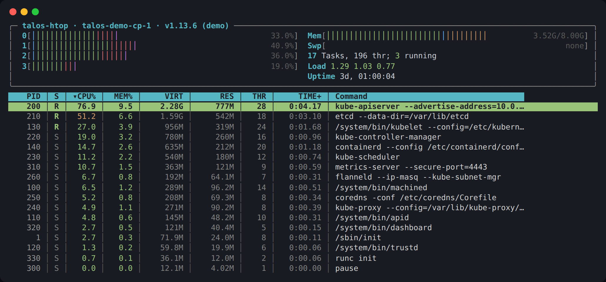
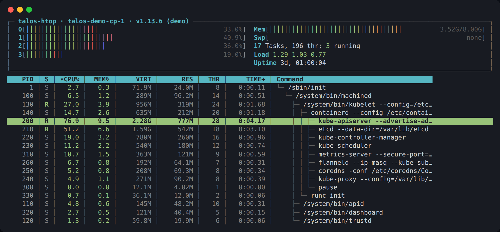

# talos-htop

An [htop](https://github.com/htop-dev/htop)-style interactive process viewer for
[Talos Linux](https://github.com/siderolabs/talos) nodes.

Talos is an API-managed operating system with **no shell and no SSH**, so the
usual `htop` — which reads `/proc` on the node — can't run there. But everything
htop needs is already exposed over Talos's authenticated **gRPC machine API**
(the same one `talosctl dashboard` uses). `talos-htop` is a small client that
polls that API and renders it as the familiar full-screen TUI, on your
workstation, against any node you can reach.



The CPU meter segments are coloured like htop (blue = nice, green = user,
red = kernel, magenta = irq/softirq); the memory meter shows used (green),
buffers (blue) and cache (yellow). Note the header box, column dividers, and the
function-key bar at the bottom.

Tree view (`t` / `F5`) nests processes under their parent PID:



## Features (iteration 1)

- **Process list** with the essential htop columns: PID, state, CPU%, MEM%,
  VIRT, RES, threads, TIME+, and the full command line.
- **Tree view** (`t` / `F5`) — processes nested under their parent PID with
  connector glyphs. Column sorting is disabled in this view (the hierarchy is
  the ordering); siblings are shown in stable PID order.
- **Total and per-core CPU** utilisation as coloured meter bars.
- **Per-process CPU%** (Irix-style, so a fully-busy core reads ~100%), computed
  from `cpu_time` deltas between polls — exactly how htop works.
- **Memory & swap** meters with the used/buffers/cache breakdown, plus per-process
  MEM%.
- **Sorting** by CPU%, MEM%, PID, TIME+, or command, with invert.
- **Incremental search / filter** (`/`).
- **`--demo` mode** with synthetic data, so you can try the UI with no cluster.

See [`docs/PLAN.md`](docs/PLAN.md) for the design and the roadmap of later
iterations (multi-node, setup screen, kill/renice, container grouping).

## Install / build

Requires Go 1.26+.

```sh
go build -o talos-htop .
# or
go install github.com/drauzju/talos-htop@latest
```

## Usage

`talos-htop` uses the same `talosconfig` resolution as `talosctl`
(`$TALOSCONFIG`, else `~/.talos/config`), so if `talosctl` works, this does too.

```sh
# Target a node via the configured endpoint
talos-htop --nodes 10.0.0.5

# Explicit config + context
talos-htop --talosconfig ./talosconfig --context prod --nodes worker-1

# Override the endpoint (apid) address directly
talos-htop --endpoints 10.0.0.5:50000 --nodes 10.0.0.5

# Explore the UI without a cluster
talos-htop --demo
```

### Flags

| Flag            | Description                                                        |
| --------------- | ------------------------------------------------------------------ |
| `--nodes`       | Node (IP or name) to target; default talks to the endpoint directly |
| `--talosconfig` | Path to talosconfig (default `$TALOSCONFIG` or `~/.talos/config`)  |
| `--context`     | talosconfig context to use                                         |
| `--endpoints`   | Comma-separated endpoint (apid) addresses, overriding the config   |
| `--refresh`     | Refresh interval (default `2s`)                                    |
| `--demo`        | Run against synthetic data, no cluster required                    |

### Keys

| Key                | Action              | Key      | Action            |
| ------------------ | ------------------- | -------- | ----------------- |
| `↑`/`↓` or `j`/`k` | Move selection      | `t`/`F5` | Toggle tree view  |
| `PgUp`/`PgDn`      | Page up / down      | `p`      | Sort by CPU%      |
| `g`/`G`            | Top / bottom        | `m`      | Sort by MEM%      |
| `/` or `F3`        | Search / filter     | `n`      | Sort by PID       |
| `i`                | Invert sort order   | `T`      | Sort by TIME+     |
| `?` or `F1`        | Toggle help         | `c`      | Sort by command   |
| `q` or `F10`       | Quit                |          |                   |

## How it maps to the Talos API

| htop concept          | Talos source                                                   |
| --------------------- | -------------------------------------------------------------- |
| Process list          | `MachineService.Processes` → `ProcessInfo`                     |
| Total & per-core CPU  | `MachineService.SystemStat` → `CPUStat` (cumulative, diffed)   |
| Memory / swap         | `MachineService.Memory` → `MemInfo`                            |
| Load average, uptime  | `MachineService.LoadAvg`, `SystemStat.boot_time`              |
| Node identity/version | `MachineService.Version`, response metadata hostname           |

CPU percentages (total, per-core, per-process) aren't reported directly — those
counters are cumulative, just like `/proc`. `talos-htop` computes them from the
delta between two consecutive polls.

## Development

```sh
go test ./...     # unit tests: sorting, tree, formatting, and a full render smoke test
go vet ./...
```

The data layer sits behind a small `source.Source` interface with two
implementations (`talos.go` for the real API, `mock.go` for `--demo`), so the UI
and the ordering/tree logic are testable without a cluster.
